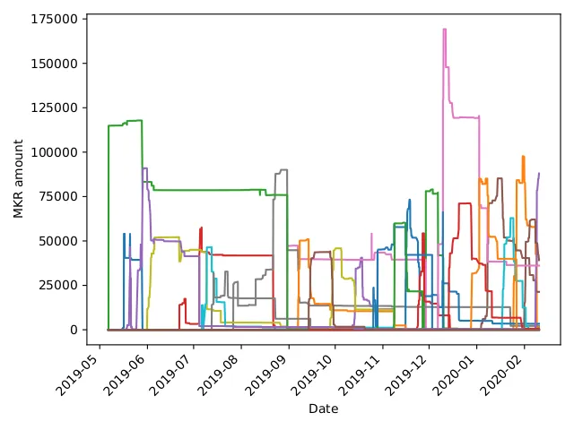
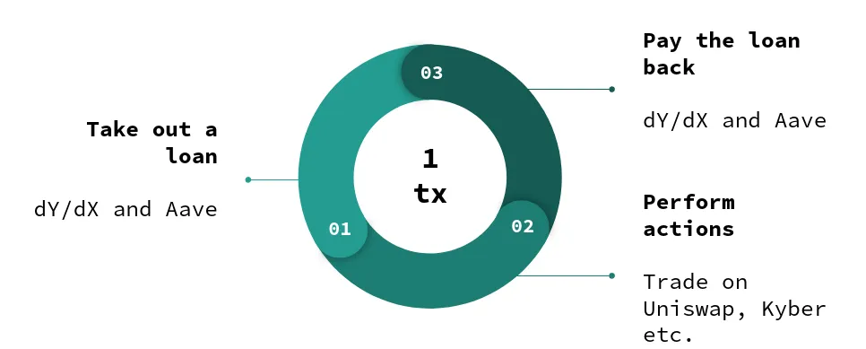
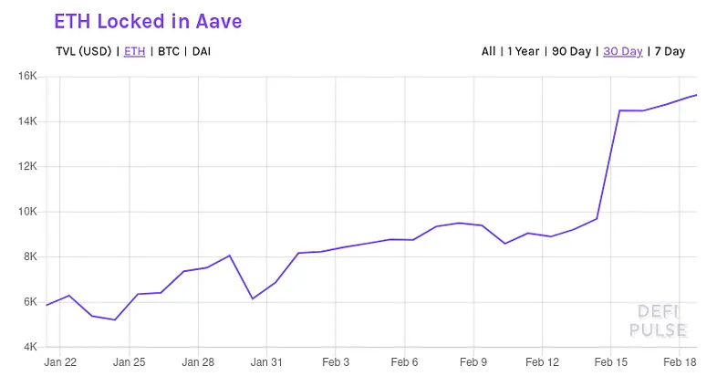
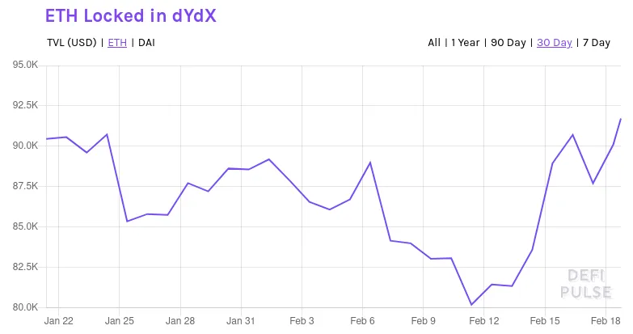
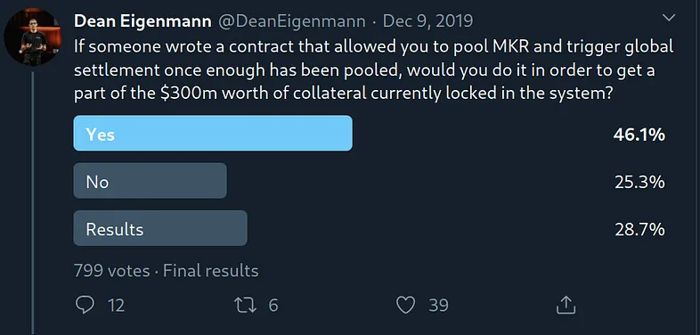

Or why Oracle Vulnerabilities are not the Worst Application of Flash Loans.

## tl;dr

- You can potentially steal all of Maker’s collateral ($700m) and issue arbitrary amounts of new Dai using flash loans if no delay for new governance contracts is introduced.
- Anyone can execute the attack and only needs to pay the transaction fees (few $) without holding any MKR.
- If Maker does not introduce a delay until the liquidity pools for flash loan pools gets above a threshold, there is little chance to prevent the attack (race condition).
- We have reached out to Maker February 8, 2020 about our research and had a call with them on February 14, 2020 to discuss our findings. Maker is aware of the attack vector [and is holding a vote this Friday 12pm PST that would prevent the attack](https://forum.makerdao.com/t/all-mkr-holders-on-friday-12pm-pst-please-vote-for-the-gsm-to-be-activated/1303).

## Introduction

Maker and its Dai stablecoin is the most popular so-called decentralized finance (DeFi) project on Ethereum with around of $700m locked in its smart contracts. The Maker protocol relies on a governance process encoded in a smart contract. MKR token holders can vote to replace an existing governance contract. Votes are proportional to the amount of MKR. The total number of MKR tokens is around 987,530 [where selected wallets or contracts hold large quantities of the token](https://etherscan.io/token/0x9f8f72aa9304c8b593d555f12ef6589cc3a579a2#balances):

- [Maker Governance Contract: 192,910 MKR]
- Maker Foundation: 117,993 MKR
- a16z: 60,000 MKR
- 0xfc7e22c6afa3ebb723bdde26d6ab3783aab9726b: 51,291 MKR
- 0x000be27f560fef0253cac4da8411611184356549: 39,645 MKR

Note: the Maker Governance Contract contains MKR tokens of multiple parties.

## Governance Attack

In a [post from December 2019, Micah Zoltu](https://medium.com/coinmonks/how-to-turn-20m-into-340m-in-15-seconds-48d161a42311) pointed out how to attack the Maker governance contract. The basic idea is to accumulate enough MKR tokens to replace the existing governance contract with the attackers, malicious, governance contract. The malicious governance contract is then able to give the attacker full control over the system and withdraw any collateral in the system as well as create arbitrary amounts of new Dai.

To reduce the number of required MKR tokens, he proposed to execute the attack when new governance contracts are being voted on. At the moment, 192,910 MKR tokens are locked in the governance contract. However, an attacker would need less tokens if, say two or three contracts, would be voted on in parallel with similar token distributions. This frequently happened in the past as we can observe in the graph below:

The obvious attack strategy would be to crowd-fund the required MKR tokens through a smart contract and pay each attacker a share of the of the winnings. However, the attackers need to amass probably around 50k MKR tokens to have a chance to attack the system without Maker noticing these movements. We do show a strategy for this in our [latest paper](https://arxiv.org/abs/2002.08099).

## A Brave New Attack Strategy: Flash Loans

However, we can completely lift the requirement to amass MKR tokens if we consider using flash loans instead. Flash loans are a fairly new concept and therefore we give a brief explanation here. Normally, an agent has to provide collateral to take out a loan in the DeFi space. For example, in Maker, Alice can borrow Dai by depositing ETH. This is required since we operate under a model of [weak identities](https://bdlt.school/files/slides/talk-rainer-b%C3%B6hme-a-primer-on-economics-for-cryptocurrencies.pdf) and [economically rational agents](https://eprint.iacr.org/2019/675).

A flash loan lifts this requirement as it only takes place in a single transaction:

1. Alice takes out the loan from a flash loan liquidity provider (e.g. Aave or dYdX)
2. Alice executes some actions (e.g. arbitrage trading on Uniswap, Fulcrum, Kyber etc.)
3. Alice pays back the flash loan with interest

A flash loan works in three steps within a single transaction.

The flash loan works because of how the Ethereum Virtual Machine is designed: if at any point during this transaction the flash loan fails, the whole transaction is reverted. Hence, Alice can take the loan risk free, i.e. if she cannot pay it back it would be like she would have never taken it. The liquidity providers are also winning: they have only lent their funds if Alice was able to pay them back.

## Arbitrage and Oracle Manipulation with Flash Loans

On February 14 and February 18, two incidents involving flash loans occurred that caused [bZx](https://bzx.network/) to halt its platform. In the [first transaction](https://etherscan.io/tx/0xb5c8bd9430b6cc87a0e2fe110ece6bf527fa4f170a4bc8cd032f768fc5219838), a single flash loan was able to make a profit of 1,193 ETH (approx. $298,250). This transaction was executed using a smart contract that opened a short position on Fulcrum on wBTC. In the same transaction, the transaction took out a wBTC loan on Compound and executed a trade of wBTC on Kyber’s Uniswap reserve resulting in slippage ultimately bringing down the price on Fulcrum as well. The full details can be found in the [post-mortem by bZx](https://bzx.network/blog/postmortem-ethdenver) and a [detailed analysis of the involved calls by PeckShield](https://medium.com/@peckshield/bzx-hack-full-disclosure-with-detailed-profit-analysis-e6b1fa9b18fc).

Similarly, a second incident occurred on February 18 where in a [single transaction](https://etherscan.io/tx/0x762881b07feb63c436dee38edd4ff1f7a74c33091e534af56c9f7d49b5ecac15) a profit of 2,378 ETH (approx. $600,000) was made. This transaction involved an initial borrowing of 7,500 ETH to take a long position on [Synthetix'](https://www.synthetix.io/tokens/) sUSD. More details are found in this [informal analysis](https://twitter.com/DegenSpartan/status/1229646531717820416?s=20).

## Oracle Manipulation to Reduce Required Liquidity

For our attack, we assume that 50k MKR are sufficient. Even if in practice the number of tokens could be higher, we point out how the concept of flash loans makes securing Maker, without a governance delay, hard. In a naive approach, the attacker could take out a flash loan to buy 50k MKR tokens.

At current exchange rates, the attacker [needs around 485,000 ETH to buy that amount of MKR as only a single exchange](https://dexindex.io/?symbol=MKR&amount=50000&action=buy), Kyber, has enough volume available. However, the attacker can also leverage multiple exchanges and buy 38k MKR from Kyber, 11.5k from Uniswap, and 500 MKR from Switcheo for a total of 378,940 ETH. That number is still high but already a reduction by almost 100,000 ETH!

An attacker can use the oracle manipulation strategies above to effectively bring down the price of MKR on Kyber and Uniswap. These are the two largest providers of MKR and have shown to be vulnerable to oracle price manipulation. Further analysis is required to determine how much the MKR price can be reduced. However, on a less liquid token like wBTC an [attacker was able manipulate the exchange rate by around 285%](https://medium.com/@peckshield/bzx-hack-full-disclosure-with-detailed-profit-analysis-e6b1fa9b18fc).

## Obtaining enough Liquidity

Even with oracle manipulation, a large number of ETH is required to execute the attack on Maker. However, an attacker can increase its liquidity by taking out two flash loans within the same transaction. Aave and dYdX protect themselves against reentrancy and allow only a single flash loan within a single transaction. But the attacker can borrow ETH from both protocols within the same transaction.

Thus, as of February 18, the attacker has a pool of around [90k ETH on dYdX](https://trade.dydx.exchange/markets) plus [17k ETH on Aave](https://app.aave.com/borrow/ETH) available. Hence, at current liquidity rates an attacker could take out a combined ~107k ETH loan from both dYdX and Aave to try to manipulate the MKR token price and obtain enough MKR tokens to replace the current Maker governance contract with its own.

For this to succeed the attacker must be able to reduce average MKR price by at least 3.54 times. Alternatively, the attacker can also wait for dYdX and Aave to increase its liquidity pools. With the current growth rate of around 5% of both protocols, it does not seem unlikely that the attack becomes possible within two months.

## Combination?

Obviously, it is possible to combine the crowd funding approach and the flash loan together. Using the available liquidity of ~107k ETH, it is possible to obtain around 10,800 MKR from Kyber. This would allow multiple attackers to reduce the required amount of pooling together 50k MKR to just around 39.2k MKR. It seems also that some people are indeed interested in such an attack as this informal Twitter poll shows:

[It can also be noted that the top four account holders](https://etherscan.io/token/0x9f8f72aa9304c8b593d555f12ef6589cc3a579a2#balances) (in fact five, but not considering the current Maker Governance Contract) are able to execute the attack without crowdfunding.

## No Time to Wait

Once enough liquidity is available through the flash loan lending pools (with or without the combination of using oracle manipulation), anyone is able to take over the Maker governance contract. Once Maker starts a vote when the liquidity pools have reached that threshold, Maker needs to ensure that MKR tokens are as little distributed as possible. If the distribution of MKR at any point in this voting procedure allows for an exploit of the vulnerability, any collateral can be taken away.

That attacker would be able to steal $700m worth of ETH collateral and be able to print new Dai at will. This attack would spread throughout the whole DeFi space as Dai is used as backing collateral in other protocols. Further, the attacker can use his Dai to trade other currencies worth around $230m. [We give a more detailed analysis in our paper.](https://arxiv.org/abs/2002.08099)

## Counter measure

Maker should put a new governance contract in place that prevents flash loans from attacking their system. Specifically, a new governance contract should be able to be checked by the Maker Foundation for malicious code and give enough time to react. At the bare minimum, a new governance contract should not be able to go live within a single transaction. That way, the attacker can likely not profit from the attack and thus not repay the flash loan.
If the attacker cannot repay the flash loan, the attack is like it would have never happened.

Maker is putting such a contract to vote on Friday, 12pm PST, February 21, 2020. [The proposed contract would activate the Governance Security Module (GSM) and prevent such a flash loan attack.](https://forum.makerdao.com/t/all-mkr-holders-on-friday-12pm-pst-please-vote-for-the-gsm-to-be-activated/1303/2)

