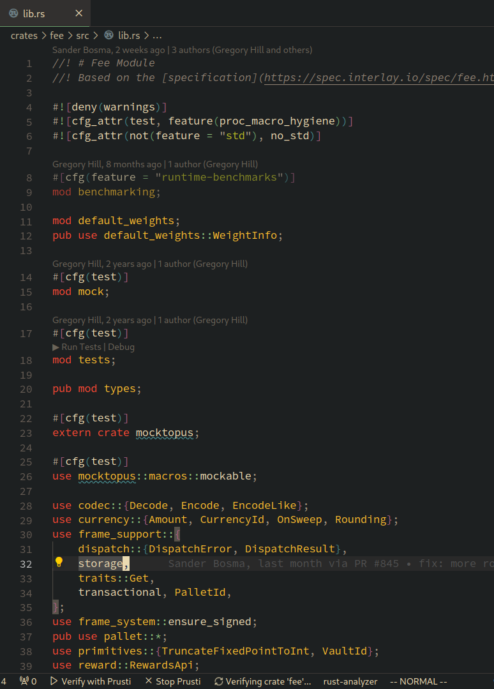

Security is hard to get right in blockchains. It's even harder to make sure that code is correct while still actively developing the product: code changes are frequent, requirements are changing, and the codebase is growing.

In this post, we'll explore options for verifying blockchain code, specifically for the Substrate blockchain framework to try to verify the code of the [Interlay blockchain](https://www.github.com/interlay/interbtc). 

My requirements for the test were simple: the tool should be integrated into the Rust toolchain (no DSLs) and I set myself a time limit of a single day to get started and get a useful result.

Spoiler alert: I managed to get two tools running and produce output. This post covers only the setup and I will follow up with more details in a future post.

## Substrate Runtimes as Verification Targets

We are building the [Interlay](https://interlay.io) and Kintsugi blockchains based on the Rust [Substrate](https://substrate.dev) framework.
For verifying that the "code is correct", we are looking for two targets:

1. **Runtime**: The WASM runtime encodes the rules of the blockchain subject to consensus verification. This is where we can potentially introduce logical errors in how the protocols are working or in their implementation such that we either impact the *safety* or *liveness* of the system.
2. **Node Implementation**: The node implementation wraps around the runtime. Bugs introduced here can impact the *liveness* of the system.

## Diving into Verification

Software verification is most often quite an academic exercise. With the adverse environment of blockchain development, there's a clear benefit of increased security assurance in the software development process.
This goes hand in hand with the [desire of the verification community to integrate verification into the development process](https://alastairreid.github.io/papers/HATRA_20/).

I'll not cover the usual testing and fuzzing tools but rather explore the three tools I found most accessible for verification in Rust.

My criteria for selecting tools were:

1. **Actively maintained**: The tool should be actively maintained and have a community around it. I checked the GitHub repositories for current contributions and when the last commit was made.
2. **Clear documentation**: The tool should have clear documentation on how to use it and get started. If after 10 minutes of parsing the available documentation, I could not get a good understanding of how to install or use the tool, I would not use it.
3. **Rust integration**: Since the idea is to integrate the tool into the normal development workflow, I was looking for a tool that integrates well with `cargo` and also does not require writing verification code in a language other than Rust.

## Selected Tools

From the tools I found, I selected the following three tools for further exploration:

- [kani](https://github.com/model-checking/kani)
- [Prusti](https://viperproject.github.io/prusti-dev/)
- [MIRAI](https://github.com/facebookexperimental/MIRAI)

More tools are available on the [Rust Formal Methods Interest Group](https://rust-formal-methods.github.io/tools.html) website and on [Alastair Reid's blog](https://alastairreid.github.io/automatic-rust-verification-tools-2021/).

For all tools, I installed them and ran them without any additional configuration against the [chain implementation](https://github.com/interlay/interbtc) of the Interlay blockchain.

### A Note on Expectations

I would be happy if a tool runs on the first try: installing the tool without issues and scanning the code base without setting up verification rules. Overall, the code is well-tested, but it is very complex: more than 1,000 dependencies, almost 100,000 lines of code, and invoking external C libraries.

## kani

From the [developer's website](https://model-checking.github.io/kani/getting-started.html):

> Kani is an open-source verification tool that uses model checking to analyze Rust programs. Kani is particularly useful for verifying unsafe code in Rust, where many of the Rust’s usual guarantees are no longer checked by the compiler.

### Getting started

I found getting started very easy with just two commands to execute:

```bash
cargo install --locked kani-verifier
cargo kani setup
```

Next, I ran kani against the runtime of the Interlay blockchain:

```bash
# From the interbtc repo root
cargo kani
```

### Compilation Errors

That produced the following error during the compilation of the `schnorrkel` crate:

```bash
error: format argument must be a string literal
   --> /home/nud3l/.cargo/registry/src/github.com-1ecc6299db9ec823/schnorrkel-0.9.1/src/batch.rs:165:47
    |
165 |     assert!(hrams.len() == public_keys.len(), ASSERT_MESSAGE);
    |                                               ^^^^^^^^^^^^^^
    |
help: you might be missing a string literal to format with
    |
165 |     assert!(hrams.len() == public_keys.len(), "{}", ASSERT_MESSAGE);
    |                                               +++++

```

At this point, I wasn't sure how to convince kani to ignore these errors in the dependencies. I tried running kani only on a single crate but it resulted in the same compiler issue.

The authors have a guide on how to get started with [real code](https://model-checking.github.io/kani/tutorial-real-code.html) but it does not include how to handle compiler errors in dependencies.

## Prusti

From the [developer's website](https://viperproject.github.io/prusti-dev/):

> Prusti is a verification tool for Rust programs. It is based on the Rust compiler and uses the Rust type system to verify Rust programs. Prusti is a research prototype and is not yet ready for production use.

### Getting started

Getting started with Prusti required downloading the Prusti Assistant VS Code extension.
I already had the required Java SDk and `rustup` versions installed so the process of getting started only involved opening a rust file and hitting the "Verify with Prusti" button on the VS Code status bar.



As the first target, the [fee pallet](https://github.com/interlay/interbtc/blob/master/crates/fee/src/lib.rs) seemed interesting as it's mildly complex, has few dependencies, and with its fixed point math might be subject to issues.

### Errors

On the first run on the fee crate, Prusti found 358 errors. That seemed quite a lot but after initial inspection, most of the errors were:

- Unsupported features (313 errors): I was expecting Prusti with its [current feature set](https://viperproject.github.io/prusti-dev/user-guide/verify/summary.html) to run into these issues as substrate makes heavy use of macros, traits, and other advanced features of Rust.
- Internal errors (24 errors): Several internal errors occured.
- Unexpected verification error (9 errors): Some verification failed.
- Verification errors (14 errors): These seem to be the ones worth investigating.

### Success

Prusti found potential overflow and underflow errors in the bitcoin crate:

```rust
// bitcoin/src/parser.rs
if position + 4 > raw_bytes.len() {
    return Err(Error::EndOfFile);
}
```

It also found possible issues with unbounded arrays:

```rust
// bitcoin/src/script.rs
pub fn op_return(return_content: &[u8]) -> Script {
    let mut script = Script::new();
    script.append(OpCode::OpReturn);
    script.append(return_content.len() as u8);
    script.append(return_content);
    script
}
```

## MIRAI

From the [developer's website](https://github.com/facebookexperimental/MIRAI):

> MIRAI is an abstract interpreter for the Rust compiler's mid-level intermediate representation (MIR). It is intended to become a widely used static analysis tool for Rust.

### Getting started

Installation of MIRAI was straightforward, following the [guide](https://github.com/facebookexperimental/MIRAI/blob/main/documentation/InstallationGuide.md):

```bash
git clone https://github.com/facebookexperimental/MIRAI.git
cd MIRAI
cargo install --locked --path ./checker
```

Next, I ran MIRAI in the interbtc root directory.

```bash
cargo mirai
```

### Compilation Errors

MIRAI produces compilation errors on the wasm builds:

```bash
     Compiling wasm-test v1.0.0 (/tmp/.tmpfNz4QS)
  error[E0463]: can't find crate for `std`
    |
    = note: the `wasm32-unknown-unknown` target may not be installed
    = help: consider downloading the target with `rustup target add wasm32-unknown-unknown`
    = help: consider building the standard library from source with `cargo build -Zbuild-std`

  error: requires `sized` lang_item

  For more information about this error, try `rustc --explain E0463`.
  error: could not compile `wasm-test` due to 2 previous errors
  warning: build failed, waiting for other jobs to finish...
  error: cannot find macro `println` in this scope
   --> src/main.rs:3:5
    |
  3 |                 println!("{}", env!("RUSTC_VERSION"));
    |                 ^^^^^^^

  error: could not compile `wasm-test` due to 3 previous errors
  ------------------------------------------------------------
```

### Success

As the wasm build is done on the entire runtime, I decided to try my luck against a single pallet instead. Similar to before, I tried the fee crate. This worked and to my surprise, MIRAI did not print any warnings or errors.

Next, I tried the bitcoin create that implements parsing and other somewhat error prone code. MIRAI gave me results here:

```bash
warning: possible attempt to subtract with overflow
   --> crates/bitcoin/src/parser.rs:239:24
    |
239 |     let target: U256 = parser.parse()?;
    |                        ^^^^^^^^^^^^^^
    |
note: related location
   --> crates/bitcoin/src/parser.rs:177:40
    |
177 |         let (result, bytes_consumed) = T::parse(&self.raw_bytes, self.position)?;
    |                                        ^^^^^^^^^^^^^^^^^^^^^^^^^^^^^^^^^^^^^^^^
note: related location
   --> crates/bitcoin/src/parser.rs:151:23
    |
151 |         let compact = U256::set_compact(bits).ok_or(Error::InvalidCompact)?;
    |                       ^^^^^^^^^^^^^^^^^^^^^^^
note: related location
   --> crates/bitcoin/src/math.rs:53:25
    |
53  |             word << 8 * (size - 3)
    |                         ^^^^^^^^^^
```

## Summary

Overall, I was very happy with the results. I was able to run two tools against the crates without additional configuration and they found potential issues. Next up will be trying to implement custom verification rules and dive deeper into the identified issues.
