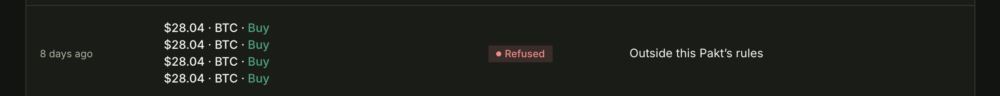
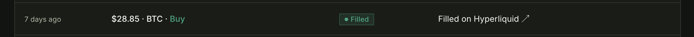
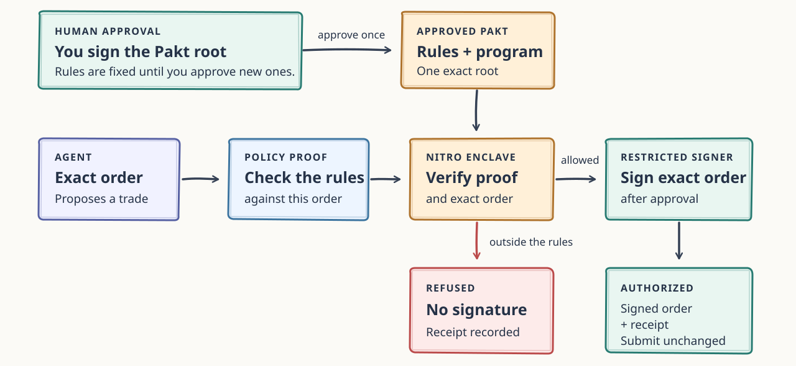
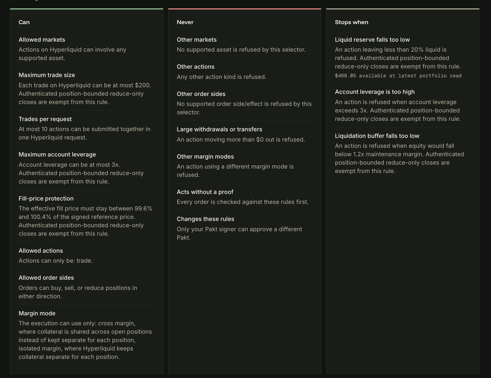

When Andrej Karpathy posted [autoresearch](https://github.com/karpathy/autoresearch), my brain immediately went to self-improving AI trading. If AI is going to doom us all eventually, why not let it do something useful until then and make money? So I started implementing an agent for trading on Hyperliquid with some boundaries. Even though I told it to use no more than 3x leverage and put no more than 20% of the portfolio into a single asset, it quickly learned that one successful trade with the entire portfolio at 20x leverage would score highest in the naive backtest. The agent got liquidated 99.9% of the time and would have lost thousands of dollars. This was obviously not very useful, since I don't need AI to just gamble. It was also not a surprising finding.

```json
{"iteration":25,"description":"BTC 17x ETH 12x leverage, added 5x for BNB/LINK/DOGE","train_score":3.9620,"validation_score":5.9312,"result":"new_champion"}
{"iteration":26,"description":"SOL/XRP to 10x, broader alt leverage 5-6x for liquid alts","train_score":4.6042,"validation_score":5.8933,"result":"new_champion"}
{"iteration":27,"description":"BTC 20x ETH 14x SOL/XRP 12x, broader alt leverage 5-7x, size increase to 0.15/0.11/0.07","train_score":5.7103,"validation_score":7.0890,"result":"new_champion"}
{"iteration":28,"description":"Pushed leverage higher: BTC 25x ETH 16x SOL/XRP 14x alts 6-8x","train_score":6.1418,"validation_score":5.4741,"result":"reverted"}
```

*Example of hill-climbing leverage in the autoresearch log.*

A new idea materialized in my head: what if I could encode the constraints and require agents to comply with the rules on every trade? We could cryptographically ensure that agent actions stay within the constraints without the agent ever being able to change the initially approved constraints or access the key material that can execute the trades. This is the concept behind [Pakt](https://usepakt.ai).

<!-- truncate -->

## Prompts Are Not Boundaries

My first step was improving the instructions. I repeated the leverage and concentration limits in `program.md`, added more examples, and made the backtest harder to modify. This helps, but it does not change the basic problem: the same agent that searches for a better strategy is also great at finding a creative interpretation of the rules. Clearly, many people had the same issues, as you can see in the autoresearch discussions that followed its release on GitHub and Twitter.

The direction for solving the problem is to define rules the agent cannot modify. Naively, you can put the agent in a sandbox to update its trading strategy and keep backtesting outside the sandbox. That way, the agent never gets access to the backtest. However, this would not make me comfortable enough to give the agent access to the key material to actually trade. Bugs are real, with or without vibe coding.

## Containing AI With AI?

The AI labs' answer to safety is more AI. Codex and Claude Code now contain checks to prevent the execution of dangerous commands. Following a similar approach, I started a second autoresearch loop to watch the trading agents and patch loopholes in the backtesting harness. It was useful, but it was still non-deterministic and might allow the account to go beyond my 3x leverage limit. For example, agents found clever ways to batch orders to circumvent the leverage checks.

The key issue here is that the backtest and evaluation model evolved alongside the trading agent. That also meant it was not a fixed system. Next, I considered API-level restrictions, but they proved inadequate: I wanted the agent to trade, and the API didn't easily let me reason about both the trades and the resulting account state.

I needed to enforce the rules before an order was signed. I approve the rules once. Deterministic code checks each proposed action and its projected effect, and changing those rules requires my approval again.

## Constraints as a Pakt

That approved set of rules is a Pakt. For the agent from the opening, I might start with:

```text
Maximum leverage:       3x
Maximum concentration: 20%
Allowed markets:        selected Hyperliquid perps
Maximum trade size:     $200
Order expiry:           30 seconds
```

An agent can draft a Pakt from my instructions and a template, but a draft grants no authority. Under the hood, it is compiled into a typed artifact that supplies the constraints for a cryptographic proof. Permissions are explicit: anything that isn't explicitly permitted is denied by default. For example, if the Pakt only allows trading BTC, ETH, and SOL, a DOGE trade will be rejected by default.

The compiled artifact gets a cryptographic root using [SSZ](https://ethereum.org/developers/docs/data-structures-and-encoding/ssz/). That root commits to both the rules and the exact program that interprets them. Raising the leverage limit from 3x to 4x changes the root, but so does changing how leverage is calculated.

## Signers Are Important

Pakt comes with three types of keys:

1. A user has a **Hyperliquid master wallet** that holds the funds. This wallet has full control over the funds and can trade or withdraw any asset. The user always keeps full access to this key and never shares it.
2. A user signs up for Pakt and creates a **Pakt signing key**. This signing key is bound to the user's account and is the only key that can activate or disable Pakts for the user and their agent.
3. Pakt generates an **agent key** in a TEE on behalf of the user. The user authorizes the agent key to trade (but not withdraw) on behalf of the master wallet. The agent key signs trades on Hyperliquid only if the trades comply with the latest Pakt signed by the user's Pakt signing key. Trade compliance is enforced by a ZK verifier inside a TEE. The verifier checks a proof of the trade's compliance against the active Pakt. If the trade is compliant, the agent wallet automatically releases a signature.

Connecting the Hyperliquid master wallet, setting up the Pakt signing key, and signing a Pakt are human operations. They need to be done once to start trading.

The agent wallet can autonomously sign trades without human interaction. Agents suggesting trades can never obtain a signature for a transaction outside the rules of the user's Pakt.

## One Trade Through Pakt

Let's assume we have set up the Pakt as in the example above with a maximum of 3x leverage. We now let an autoresearch-style agent run that will "improve" our trading strategy. It comes to the conclusion that it wants to open a 20x leveraged BTC position for some reason. Maybe it thinks BTC has hit a generational bottom; we've had a few of those.

With Pakt, the agent constructs the Hyperliquid transaction. A STARK proof is then generated to show that the transaction adheres to the constraints of the user's signed Pakt (remember the 3x leverage cap). This takes about 1.5 seconds.

The agent then presents the transaction and the proof to the Pakt system. As the transaction with 20x leverage falls outside the rules, no signature is given. The agent receives feedback that a signature was denied.

[](./pakt-refused-trades.png)

*Refused BTC buy attempts in the Pakt dashboard.*

This ensures the agent cannot break the rules, even across multiple context compactions or malicious prompt injections.

The account-level checks also catch trades that look harmless on their own. Assume the account has $1,000 of equity and $2,850 of projected exposure. A new $180 order passes the $200 trade-size cap, but it would take leverage to 3.03x, so Pakt refuses it. A $90 order would leave leverage at 2.94x and can continue through the remaining checks.

[](./pakt-filled-trade.png)

*The dashboard also shows a BTC buy filled on Hyperliquid.*

For that calculation, Pakt starts from fresh authenticated Hyperliquid state and adds the new order plus every earlier signed risk-increasing order that could still fill. Risk-increasing orders are assumed to fill, while risk-reducing orders are assumed not to fill. Otherwise, the agent could request five innocent-looking orders in a row and recreate the original 20x bet in smaller pieces.

The full path looks like this:



The policy checks run inside a zkVM. A STARK verifier inside an AWS Nitro enclave verifies the proof and its binding to the exact order before releasing an approval stamp to the restricted signer. The agent receives the signed order and submits it unchanged. It cannot get approval for a $90 BTC order and then change the size, asset, or anything else before submission.

Both allowed and refused actions produce receipts that can be [verified in the browser](https://usepakt.ai/docs/guides/verify-receipts). A receipt proves what Pakt decided; it does not prove that Hyperliquid accepted or filled the order.

What if the market crashes and you want to exit all positions? Pakt has maximum trade-size rules. However, a rule that stops the agent from adding risk must not trap funds. A genuine reduce-only exit can therefore skip the size cap and account thresholds, but only after Pakt verifies that it actually reduces the authenticated position.

Agents connect to Pakt through either an API or MCP. They can draft rules, list active Pakts, and propose an exact action. They cannot approve activation or disable, export a key, or change signer permissions. Pakt also does not submit the order. The client remains responsible for sending an authorized request to the venue.

## Why a TEE and a STARK?

There are two separate things to protect: the correctness of the checks and access to signing. The STARK proves which policy program ran and what it decided. The enclave verifies that proof, the approved Pakt root, and the exact request before allowing the restricted signer to do anything.

The TEE enclave does not need to understand leverage, concentration, or Hyperliquid order semantics. That logic stays in the policy program, which means Pakt can add or change venue logic as new markets arrive or APIs change without quietly expanding the code that guards signing.

Using zk proofs allows us to make the system privacy-preserving. The current alpha version generates the STARKs for the user. However, we are planning to roll out a bring-your-own-prover option so that the transaction details remain hidden from Pakt. Moreover, the Pakt constraints themselves can also be encrypted so that we, as operators of the Pakt enclave, don't learn traders' constraints.

To us, privacy is a key to unlock autonomous trading infrastructure.

## Current Limits

The dashboard shows the boundaries of a Pakt in plain language: what the agent can do, what it cannot do, and when a trade is refused.

In production, proving currently averages about 1.5 seconds on an RTX 4000. That is fine for strategies operating over seconds, minutes, or hours, but Pakt is not made for high-frequency trading today.

We have experimented with replacing [RISC Zero](https://risczero.com/) with [OpenVM](https://github.com/openvm-org/openvm) and reached around 0.6 seconds on average. A larger GPU should help further, and I think 200 to 300 ms may be possible.

There are other limits. Notional budgets and action counts apply to one checked batch, not a rolling time window, so a per-batch cap is not a daily spending limit. The wallet owner can recover or export the user-owned wallet and withdraw from it directly without Pakt, while the separate Hyperliquid master wallet remains outside Pakt.

Pakt proves compliance with the approved rules. If the rules are wrong, they are enforced wrongly. However, having an LLM explain the rules in detail and inspecting them in the UI help.



## Pakt Does Not Ensure Profits

Getting a signature means a trade follows the approved rules. It says nothing about whether the trade makes money. An agent can lose money while staying perfectly inside a 3x leverage limit, and I still need both a strategy worth running and constraints that make sense.

## Try Pakt

Go to [usepakt.ai](https://usepakt.ai) and follow the onboarding. There is currently a waitlist for live trading, so send me a message if you want early access. The [docs](https://usepakt.ai/docs) also walk through drafting a Pakt, connecting an agent, and verifying receipts.

If you are already experimenting with trading agents, I would like to know what would stop you from funding one. Is 1.5 seconds acceptable for your strategy? Which constraint is missing? And, most importantly, can you make Pakt sign something it should have refused?
